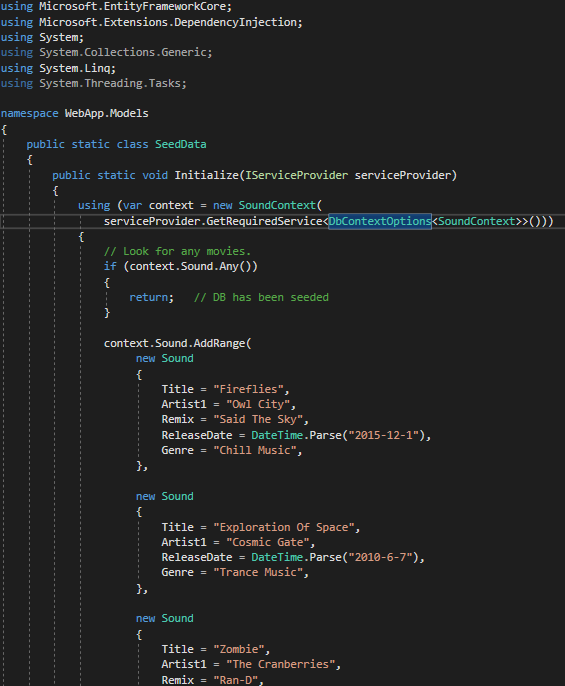
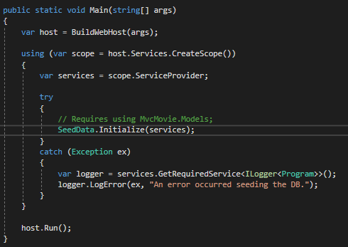
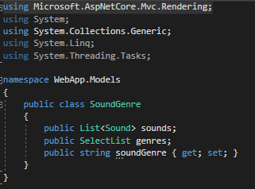
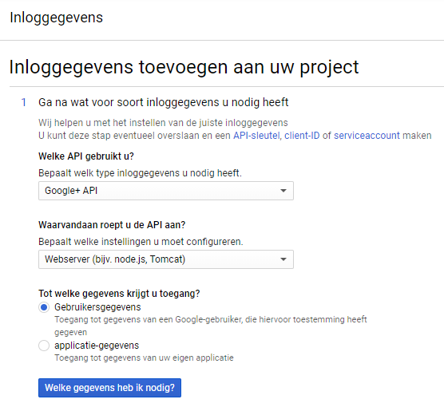
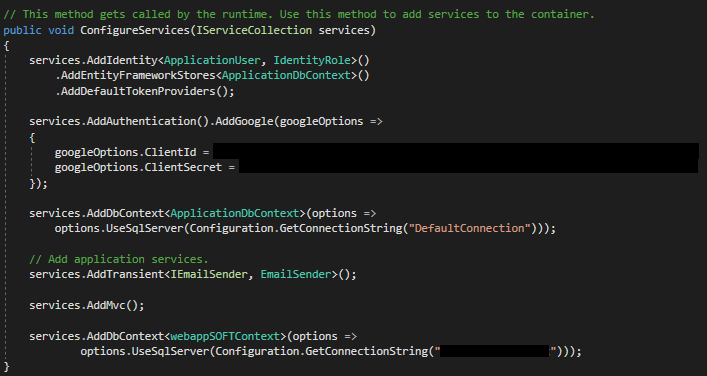
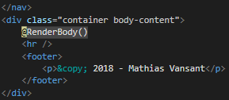

# WebappSoftware

Stappenplan:

## Maak een nieuw project aan.


Kies voor een `ASP.NET Core Web Application`.


Selecteer `Web Application (Model-View-Controller)`, en kies `Individual User Accounts`. `Docker Support` gaan we **niet** gebruiken.


## Maak een nieuw model aan.

Maak een nieuwe file aan in de Models folder: Een Class met de naam `Sound.cs`.


Geef onze Sound enkele properties: 
```
- ID (int)
- Title (string)
- Artist 1-3 (string) -> Veel songs hebben 2 artiesten, sommige zelfs 3.
- Remix (string)
- ReleaseDate (DateTime)
- Genre (string)
```


Merk op: Gebruik `[Display(Name = "...")]` om de properties mooier weer te geven. Let op, hiervoor zal u `using System.ComponentModel.DataAnnotations;` moeten toevoegen.


## Maak een nieuwe controller aan.

Klik rechts op de map controllers, hover over Add en klik op Controller.


Klik op her pijltje rechts van de balk, en selecteer onderaan `Sound (WebApp.Models)`.


Klik daarna op het plusteken dat u onder het pijltje vindt. Hier veranderd u de naam van het project naar `Sound`. Zo krijgt u `WebApp.Models.SoundContext`. Klik op Add.


U heeft nu alles ingevuld. Entity Framework heeft de naam van de controller zelf aangepast naar SoundsController. Dit moet niet veranderd worden. Even een overzicht:


Klik op Add.

## Maak een Local Database aan.

Open de NuGet Package Manager Console via `Tools -> NuGet Package Manager -> NuGet Package Manager Console`.


Type `Install-Package Microsoft.EntityFrameworkCore.Tools`.

Type `Add-Migration Initial -Context SoundContext`

Type `Update-Database -Context SoundContext`

Uw Database is nu klaar voor gebruik.

-- Tussentijdse test --

Type `Ctrl + f5` om het project uit te voeren.

U ziet de volgende pagina:


U ziet de Url bovenaan eindigen met een code (poort). type hier `/Sounds` achter.

U ziet de volgende pagina: 


U kan hier de 'Create New' knop eens testen, deze zal werken. Als u een item heeft toegevoegd ziet u de ingegeven data en de knoppen Edit, Details en Delete. Deze knoppen zullen ook al werken. Voorbeeld:


Wanneer u dit project op meerdere computers wil testen, zal u altijd een nieuwe database moeten namaken. Nadien elke keer nieuwe test-data aan te maken is echter verloren tijd. Hier kunnen we gemakkelijk de SeedData voor gebruiken. Dit is data die elke keer geladen zal worden, zodat die niet meer handmatig ingegeven moet worden. Het enige dat u dan elke keer zal moeten herhalen, zijn de 3 zinnetjes onder de tab Database.

## SeedData

Maak een nieuwe Class `SeedData.cs` aan in de Models folder.


Maak hier enkele standaard items aan. Zorg ervoor dat je genoeg data hebt om mee te testen. Voorbeeld:



Let op, u zal `using Microsoft.EntityFrameworkCore;` en `using Microsoft.Extensions.DependencyInjection;` moeten toevoegen.

Ga naar de `Program.cs` file. Verander deze Main-method:


naar deze Main-method:



Let op: u zal `using Microsoft.Extensions.DependencyInjection;` en `using WebApp.Models;` moeten toevoegen.

-- Tussentijdse test --

Type `Ctrl + f5` om het project uit te voeren, en type /sounds achter de url.

U krijgt nu de webpagina met de standaardcode te zien die u heeft ingegeven in SeedData.cs:


U kan nu beginnen met de extra opties van uw website, zoals sorteren op Genre, Titel of Artist.

## Data Sorteren

Ga in de map Views naar de map Sounds, en klik op `Index.cshtml`. Zoals u uit de extensie kan opmaken, is dit een html-file waar u ook C# code kan gebruiken. 

U ziet deze code: 


Voeg hier het volgende stukje html aan toe:


We voegen hier een form toe, met een filterknop en 2 tekstvakken. 1 om te sorteren op Title en 1 om te sorteren op Artist.

-- Tussentijdse test --

Wanneer we ons programma nog eens uitvoeren en naar de sounds pagina gaan, zien we een verschil:


We kunnen hier al iets ingeven en op de filterknop duwen, maar er zal niets gebeuren. We moeten deze code namelijk nog koppelen. 

Ga naar de map Controllers en klik op `SoundsController.cs`.

Verander de Index-method van:


naar:


Merk deze lijn code op: `sounds = sounds.Where(s => s.Artist1.Contains(artistSearchString) || s.Artist2.Contains(artistSearchString) || s.Artist3.Contains(artistSearchString));`.

Op deze manier zoeken we de ingegeven artiestennaam in alle 3 de Artist-velden tegelijk.

Dit kunnen we nu ook testen. Ga terug naar de sounds-pagina en filter de Titel eens op de letter 'b'.


Dat werkt. Probeer nu Artist eens op 'd' te filteren. 


Merk op dat hier in de tweede song, eerste artist geen letter 'd' in zijn naam heeft, maar de tweede artist wel. Alles werkt dus!

We willen nu echter ook de sounds op Genre sorteren, en we willen dat de gebruiker een genre kan kiezen uit een lijstje. Dit is meteen een beetje ingewikkelder, maar de volgende info loodst u er wel doorheen.

Voeg een nieuwe Class `SoundGenre.cs` toe aan de map Models, en voeg de volgende code eraan toe:



Let op, u zal `using Microsoft.AspNetCore.Mvc.Rendering;` moeten toevoegen.

Ga nu naar de `SoundsController.cs` in de Controller map. Update de Index-method zoals hier:


We voegen hier een zoekoptie toe voor soundGenre via de IQueriable genreQuery, die haalt alle bestaande genres uit de database. De SelectList zorgt ervoor dat we geen dubbele genres hebben. We combineren dit met de eerdere zoekopties m.b.v. de variabele soundGenreVM waar we gebruik maken van de Class SoundGenre. 

Nu moeten we ook de Index.cshtml van Sounds nog updaten.

Allereerst veranderen we de eerste regel van het document van `@model IEnumerable<WebApp.Models.Sound>` naar `@model WebApp.Models.SoundGenre`

We zien een hoop errors verschijnen. Geen nood, in de volgende stappen verhelpen we ze 1 voor 1.

We voegen een select-optie toe, waaruit u kan kiezen uit alle genres. 


Niet alleen het uiterlijk moet veranderd worden, ook moeten we nog wat aanpassen zodat de data gevonden kan worden. Onder het form vindt u een table tag. 


We voegen hier telkens `.sounds[0]` toe, zoals u kan hier kan zien:


Onder de thead tag ziet u een foreach-loop staan. Ook hier moet een kleine aanpassing gebeuren: 


Zet achter Model nog .sounds: `Model.sounds`


U ziet dat alle errors opgelost zijn.

-- Tussentijdse test --

Voer uw project nogmaals uit.

U ziet dat het form zich heeft aangepast, en u kan nu kiezen uit de beschikbare genres.


Probeer eens te filteren op Hardstyle Music.


Moest u het nog niet geprobeerd hebben, u kan ook op Genre, Title en Artist tegelijk sorteren. Erg handig met grote hoeveelheden data.

Gefeliciteerd, u heeft nu een werkende app. 

## Google Authentication

We hebben in het begin gekozen voor Individual User Accounts, net om er later dit aan toe te voegen. 

Deel 1: Google

Ga naar https://console.developers.google.com/projectselector/apis/library

Log u in met uw google account.

Maak een nieuw project.


Geef uw project een passende naam. Merk op: u ziet hier ook hoeveel gratis projecten u nog over heeft.


Zoek de Google+ API


Schakel de Google+ API in.


Maak inloggegevens.


Selecteer Webserver (bijv. node.js, Tomcat) en Gebruikergegevens. Klik op "Welke gegevens heb ik nodig?".



Laat de naam onveranderd (maakt niet echt uit) en voeg deze url "http://localhost:44320/signin-google" toe aan het onderste `https://...` vakje. Let op: http, niet https. https werkt soms niet. Klik op "Client-ID maken".


Laat de automatisch ingevulde email onveranderd, en geef een officiële productnaam in. Klik op "Doorgaan".


Klik niet op downloaden, wel op "Gereed".

U bent nu klaar met het deel op de Google-website.


Sluit deze pagina nog **NIET**!! U heeft nog codes nodig in het volgende deel.

Deel 2: Visual Studio

Ga naar de Startup.cs file.

Zoek de ConfigureServices-method (2e van boven).

Update de method van:


naar:



Ga terug naar de Google-pagina:


Klik op "Webclient 1"


U ziet bovenaan een Client-ID en Clientgeheim staan. Dit zijn uiterst geheime codes, dus ga er voorzichtig mee om.

Vul nu deze codes in in de startup.cs file van het project, tussen "double quotes". Client-ID bij Client-ID, Clientgeheim bij Clientgeheim.

Deel 3: Poort zetten

Rechtsklik op je project, rechts op je scherm. Selecteer "Properties". 


Ga vervolgens naar de tab "Debug".


In het midden, rechts naast "Launch browser", ziet u een url die al een poort bevat. verander deze poort naar 44320.
Ook onderaan naast App URL ziet u een url staan. Verander ook deze poort naar 44320. Let op: beide urls moeten ook http zijn, niet https!


-- Tussentijdse test --

Sluit in uw browser uw applicatie even, en voer in uw project opnieuw Ctrl + f5 uit. Dit is nodig omdat u de poort hebt veranderd.

Klik in uw navigatiebalk op "Log In", en klik op "Google".


Selecteer uw email-adres. U krijgt volgende error te zien:


Klik op de blauwe knop "Apply Migrations". Refresh na een tiental seconden (afhankelijk van hoe snel uw pc werkt...)

U krijgt nu een registerpagina voor u. 


Klik op Register.

U ziet nu bovenaan in uw navigatiebalk "Hello ...!" verschijnen. U bent ingelogd!


## Link leggen

Tot hiertoe moesten we steeds /sounds toevoegen aan de url om naar onze webapp te gaan. Hier leg ik uit hoe je dat veranderd.

Zoals je misschien al hebt gemerkt, doen de knoppen WebApp en Home in de navigatiebalk exact hetzelfde: ze brengen je naar de Home Page.
Wat als we de knop met het grootste lettertype nu Home noemen en naar Home laten referreren, en de knop met het kleinere lettertype Sounds noemen en die naar onze webapp laten referreren? Dat maakt het ons en de gebruiker een pak makkelijker om de app te vinden.

Ga in de map Views naar de map Shared en klik dan op \_Layout.cshtml .

Verander een paar dingetjes (rood aangeduid in tweede foto) van:


naar:


Test maar eens uit! 
Ps: Omdat \_Layout.cshtml een 'Shared' file is, zal dit ineens op alle pagina's worden toegepast: de navigatiebalk blijft op alle pagina's hetzelfde.

## Titels

Wanneer we onze app bekijken, zien we nog de gewone "Index" titel. Deze wil ik veranderen naar "Sounds".
Ook hetgeen we in ons google-tab zien helemaal bovenaan de site, wil ik veranderen van "Index - WebApp" naar "Sounds".

Ga in de map Views naar de map Sounds en klik op Index.cshtml .

Verander hier twee keer "Index" naar "Sounds". 


Zo is onze titel al klaar, maar hebben we nog steeds een vervelende "- WebApp" bovenaan.

Ga in de map Views naar de map Shared en klik dan op \_Layout.cshtml .

Bovenaan ziet u bijna meteen de tag title. Hier kan u de "- WebApp" gerust verwijderen. Omdat \_Layout.cshtml een 'Shared' file is, zal dit ineens op alle pagina's worden toegepast.


Ziehier: de nieuwe navigatiebalk en titel:


En ook het tabblad heeft een andere naam: 


## Copyright

Sommigen zullen ook graag de standaard Copyright willen aanpassen.

Ga in de map Views naar de map Shared en klik dan op \_Layout.cshtml . Net onder de code voor de navigatiebalk vindt u de footer tag. Hierin kan u de standaard copyright-tekst aanpassen.



Controleer maar eens op je site!

## Home Page Update

De reclame van Microsoft op mijn Home Page is niet echt handig... Dus ik wil iets fris, met eigen afbeeldingen. Het carousel wil ik wel behouden, zo kan ik meerdere foto's laten zien. In dit voorbeeld gebruik ik ook 4 foto's, elk met een breedte van 1140 pixels en een hoogte van 360 pixels. Zo zijn ze even groot als de standaard svgs en hebben we zeker geen problemen.

Als je 4 foto's hebt (of je vindt mijn foto's in de map "img/wallpapers", kan je ze best eerst bewerken (de mijne zijn al bewerkt). Als je er tekst bij wil, kan je die er best al bijzetten. Dit is veel moeilijker via de code zelf. Een beetje hacky, maar dat is niet erg.

Houd je foto's even bij de hand. Ga in je project naar wwwroot/images. Sleep je afbeeldingen 1 voor 1 naar deze map. Als ze er alle 4 in staan, mag je de 4 svgs verwijderen.


Ga in de map Views naar de map Home, en klik op Index.cshtml . 

Hier ziet u de originele code:


Hier zijn enkele aanpassingen gemaakt. Zoals u ziet is de hele p tag verwijderd. Dat wil zeggen dat de tekst en de "Learn More"-knop weg zijn. Wilt u deze behouden, verwijder dit dan niet, maar pas de link en dergelijke even aan. Ook ziet u dat de source van de images is aangepast: src="". Doe dit voor alle 4 de carousel-items.


Ps: Ik heb hier ineens de titel "Home Page" veranderd naar "Home".

-- Tussentijdse test --


De tekst daaronder lijkt misschien niet zo nuttig, maar ik heb hem een tweede leven gegeven. De opmaak is er immers al, dus moeten we enkel nieuwe tekst ingeven! 

Dit is een deel van de origenele code: 


En dit heb ik ervan gemaakt:


En voila, uw Home-pagina ziet er al veel beter uit!


COMING: 
- About-page
- Contact-page
- Publish on MS Azure
- Facebook auth.

