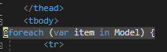

# WebappSoftware

Stappenplan:

## Maak een nieuw project aan.


Kies voor een `ASP.NET Core Web Application`.


Selecteer `Web Application (Model-View-Controller)`, en kies `Individual User Accounts`. `Docker Support` gaan we **niet** gebruiken.


## Maak een nieuw model aan.

Maak een nieuwe file aan in de Models folder: Een Class met de naam `Sound.cs`.


Geef onze Sound enkele properties: 
```
- ID (int)
- Title (string)
- Artist 1-3 (string) -> Veel songs hebben 2 artiesten, sommige zelfs 3.
- Remix (string)
- ReleaseDate (DateTime)
- Genre (string)
```


Merk op: Gebruik `[Display(Name = "...")]` om de properties mooier weer te geven. Let op, hiervoor zal u `using System.ComponentModel.DataAnnotations;` moeten toevoegen.


## Maak een nieuwe controller aan.

Klik rechts op de map controllers, hover over Add en klik op Controller.


Klik op her pijltje rechts van de balk, en selecteer onderaan `Sound (WebApp.Models)`.


Klik daarna op het plusteken dat u onder het pijltje vindt. Hier veranderd u de naam van het project naar `Sound`. Zo krijgt u `WebApp.Models.SoundContext`. Klik op Add.


U heeft nu alles ingevuld. Entity Framework heeft de naam van de controller zelf aangepast naar SoundsController. Dit moet niet veranderd worden. Even een overzicht:


Klik op Add.

## Maak een Local Database aan.

Open de NuGet Package Manager Console via `Tools -> NuGet Package Manager -> NuGet Package Manager Console`.


Type `Install-Package Microsoft.EntityFrameworkCore.Tools`.

Type `Add-Migration Initial -Context SoundContext`

Type `Update-Database -Context SoundContext`

Uw Database is nu klaar voor gebruik.

-- Tussentijdse test --

Type `Ctrl + f5` om het project uit te voeren.

U ziet de volgende pagina:


U ziet de Url bovenaan eindigen met een code (poort). type hier `/Sounds` achter.

U ziet de volgende pagina: 


U kan hier de 'Create New' knop eens testen, deze zal werken. Als u een item heeft toegevoegd ziet u de ingegeven data en de knoppen Edit, Details en Delete. Deze knoppen zullen ook al werken. Voorbeeld:


Wanneer u dit project op meerdere computers wil testen, zal u altijd een nieuwe database moeten namaken. Nadien elke keer nieuwe test-data aan te maken is echter verloren tijd. Hier kunnen we gemakkelijk de SeedData voor gebruiken. Dit is data die elke keer geladen zal worden, zodat die niet meer handmatig ingegeven moet worden. Het enige dat u dan elke keer zal moeten herhalen, zijn de 3 zinnetjes onder de tab Database.

## SeedData

Maak een nieuwe Class `SeedData.cs` aan in de Models folder.


Maak hier enkele standaard items aan. Zorg ervoor dat je genoeg data hebt om mee te testen. Voorbeeld:


Let op, u zal `using Microsoft.EntityFrameworkCore;` en `using Microsoft.Extensions.DependencyInjection;` moeten toevoegen.

Ga naar de `Program.cs` file. Verander deze Main-method:


naar deze Main-method:


Let op: u zal `using Microsoft.Extensions.DependencyInjection;` en `using WebApp.Models;` moeten toevoegen.

-- Tussentijdse test --

Type `Ctrl + f5` om het project uit te voeren, en type /sounds achter de url.

U krijgt nu de webpagina met de standaardcode te zien die u heeft ingegeven in SeedData.cs:


U kan nu beginnen met de extra opties van uw website, zoals sorteren op Genre, Titel of Artist.

## Data Sorteren

Ga in de map Views naar de map Sounds, en klik op `Index.cshtml`. Zoals u uit de extensie kan opmaken, is dit een html-file waar u ook C# code kan gebruiken. 

U ziet deze code: 


Voeg hier het volgende stukje html aan toe:


We voegen hier een form toe, met een filterknop en 2 tekstvakken. 1 om te sorteren op Title en 1 om te sorteren op Artist.

-- Tussentijdse test --

Wanneer we ons programma nog eens uitvoeren en naar de sounds pagina gaan, zien we een verschil:


We kunnen hier al iets ingeven en op de filterknop duwen, maar er zal niets gebeuren. We moeten deze code namelijk nog koppelen. 

Ga naar de map Controllers en klik op `SoundsController.cs`.

Verander de Index-method van:


naar:


Merk deze lijn code op: `sounds = sounds.Where(s => s.Artist1.Contains(artistSearchString) || s.Artist2.Contains(artistSearchString) || s.Artist3.Contains(artistSearchString));`.

Op deze manier zoeken we de ingegeven artiestennaam in alle 3 de Artist-velden tegelijk.

Dit kunnen we nu ook testen. Ga terug naar de sounds-pagina en filter de Titel eens op de letter 'b'.


Dat werkt. Probeer nu Artist eens op 'd' te filteren. 


Merk op dat hier in de tweede song, eerste artist geen letter 'd' in zijn naam heeft, maar de tweede artist wel. Alles werkt dus!

We willen nu echter ook de sounds op Genre sorteren, en we willen dat de gebruiker een genre kan kiezen uit een lijstje. Dit is meteen een beetje ingewikkelder, maar de volgende info loodst u er wel doorheen.

Voeg een nieuwe Class `SoundGenre.cs` toe aan de map Models, en voeg de volgende code eraan toe:


Let op, u zal `using Microsoft.AspNetCore.Mvc.Rendering;` moeten toevoegen.

Ga nu naar de `SoundsController.cs` in de Controller map. Update de Index-method zoals hier:


We voegen hier een zoekoptie toe voor soundGenre via de IQueriable genreQuery, die haalt alle bestaande genres uit de database. De SelectList zorgt ervoor dat we geen dubbele genres hebben. We combineren dit met de eerdere zoekopties m.b.v. de variabele soundGenreVM waar we gebruik maken van de Class SoundGenre. 

Nu moeten we ook de Index.cshtml van Sounds nog updaten.

Allereerst veranderen we de eerste regel van het document van `@model IEnumerable<WebApp.Models.Sound>` naar `@model WebApp.Models.SoundGenre`

We zien een hoop errors verschijnen. Geen nood, in de volgende stappen verhelpen we ze 1 voor 1.

We voegen een select-optie toe, waaruit u kan kiezen uit alle genres. 


Niet alleen het uiterlijk moet veranderd worden, ook moeten we nog wat aanpassen zodat de data gevonden kan worden. Onder het form vindt u een <table>. 


We voegen hier telkens `.sounds[0]` toe, zoals u kan hier kan zien:


Onder de <thead> ziet u een foreach-loop staan. Ook hier moet een kleine aanpassing gebeuren: 



Zet achter Model nog .sounds: `Model.sounds`


U ziet dat alle errors opgelost zijn.

-- Tussentijdse test --

Voer uw project nogmaals uit.

U ziet dat het form zich heeft aangepast, en u kan nu kiezen uit de beschikbare genres.


Probeer eens te filteren op Hardstyle Music.


Moest u het nog niet geprobeerd hebben, u kan ook op Genre, Title en Artist tegelijk sorteren. Erg handig met grote hoeveelheden data.

Gefeliciteerd, u heeft nu een werkende app. 

Extra opties: COMING SOON !!
- google auth
- home page: update
- details


